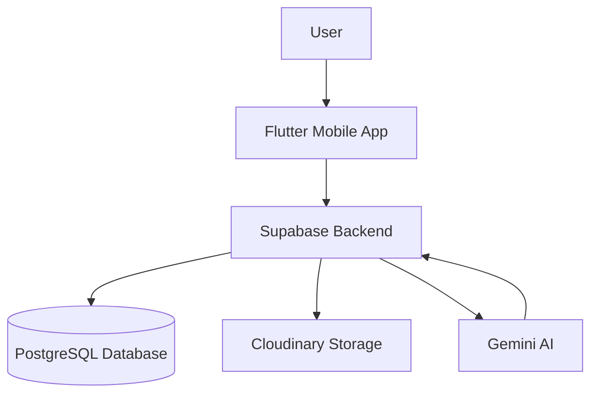
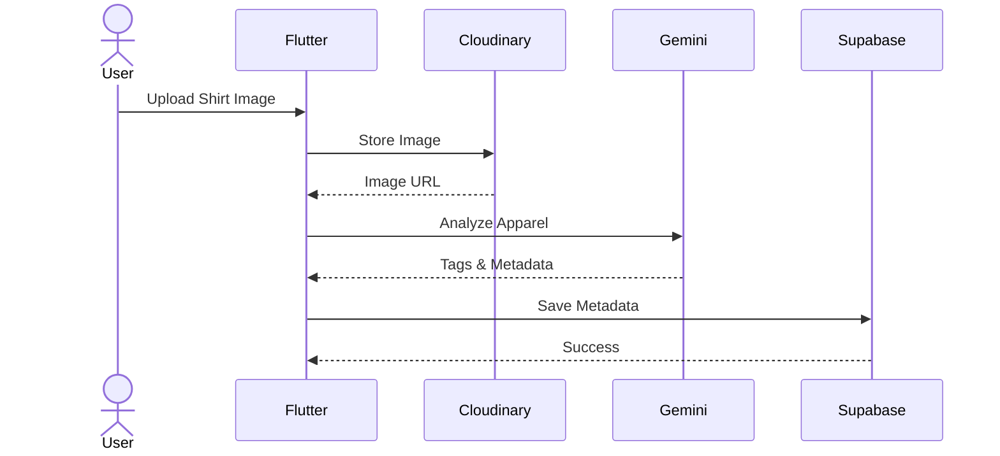

# High-Level Design (HLD)

## Overview

The Wardrobe AI application is a mobile-first platform that enables users to upload clothing items, organize their wardrobe, generate AI-powered outfit recommendations, save outfits, and track clothing usage.

---

## System Architecture



---

## Components

### 1. Mobile Application

**Technology:** Flutter

**Responsibilities**
- User Authentication
- Upload Clothing Items
- View Wardrobe
- Save Outfits
- View Recommendations
- Wear Tracking
- Search Functionality
- Favorites Management

---

### 2. Backend API

**Technology:** Supabase Edge Functions (TypeScript)

**Responsibilities**
- Business Logic
- API Endpoints
- Authentication Validation
- AI Integration
- Data Processing
- Database Operations

---

### 3. Database

**Technology:** Supabase PostgreSQL

**Responsibilities**
- Store User Data
- Store Clothing Metadata
- Store Outfit Information
- Store Favorites
- Store Wear History

---

### 4. Image Storage

**Technology:** Cloudinary

**Responsibilities**
- Store Clothing Images
- Image Optimization
- CDN Delivery
- Image Transformations

---

### 5. AI Recommendation Service

**Technology:** Gemini API

**Responsibilities**
- Clothing Classification
- Color Detection
- Metadata Extraction
- Outfit Recommendations

---

## Technology Stack

| Layer | Technology |
|---------|-----------|
| Frontend | Flutter |
| State Management | Riverpod |
| Navigation | GoRouter |
| Backend | Supabase Edge Functions |
| Database | PostgreSQL (Supabase) |
| Authentication | Supabase Auth |
| Image Storage | Cloudinary |
| AI Service | Gemini API |

---

## Data Flows

### User Registration

```text
Flutter App
      |
      v
Supabase Auth
      |
      v
User Account Created
```

---

### Upload Clothing Item



---

### Generate Outfit Recommendation


---

### Save Outfit

```text
Flutter App
      |
      v
Backend API
      |
      v
Supabase Database
      |
      v
Outfit Saved
```

---

### Wear Tracking

```text
User Wears Outfit
      |
      v
Flutter App
      |
      v
Backend API
      |
      v
Wear History Storage
      |
      v
Recommendation Engine Updated
```

---

## External Integrations

### Cloudinary
- Image Storage
- Image Optimization
- CDN Delivery

### Gemini API
- Clothing Classification
- Color Detection
- Outfit Recommendation Generation

### Supabase
- Authentication
- PostgreSQL Database
- Edge Functions

---

## Scalability Considerations

- Stateless Backend Functions
- CDN-Based Image Delivery
- Database Indexing for Search
- Modular AI Service Layer
- Future Support for Additional Recommendation Models

---

## Assumptions

- Initial target of 100 active users
- Free-tier deployment
- Mobile-first experience
- Single-region deployment
- English language support only (v1)
- Weather-based recommendations planned for future releases