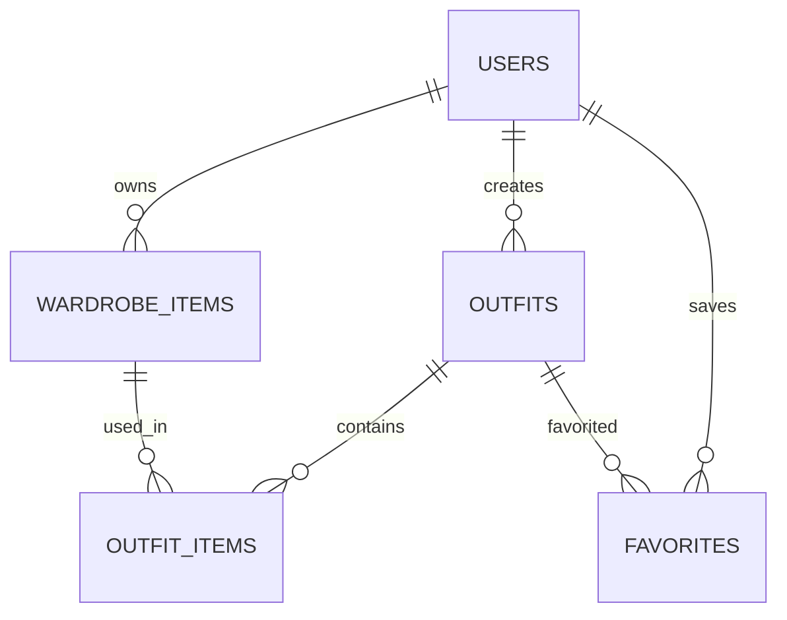

# Low-Level Design (LLD)

## Overview

The Low-Level Design (LLD) defines the internal structure of the Wardrobe AI application, including database schemas, API contracts, folder structure, state management, and component interactions.

---

# 1. Database Design

## users

Managed by Supabase Auth.

| Column | Type | Description |
|----------|----------|-------------|
| id | UUID | Primary Key |
| email | VARCHAR | User Email |
| created_at | TIMESTAMP | Account Creation Date |

---

## wardrobe_items

Stores all clothing items uploaded by users.

| Column | Type | Description |
|----------|----------|-------------|
| id | UUID | Primary Key |
| user_id | UUID | FK → users.id |
| name | VARCHAR(100) | Item Name |
| category | VARCHAR(50) | Top, Bottom, Shoes, etc. |
| color | VARCHAR(50) | Primary Color |
| image_url | TEXT | Cloudinary URL |
| brand | VARCHAR(100) | Optional |
| season | VARCHAR(50) | Optional |
| favorite | BOOLEAN | Favorite Flag |
| created_at | TIMESTAMP | Upload Time |

---

## outfits

Stores user-created outfits.

| Column | Type | Description |
|----------|----------|-------------|
| id | UUID | Primary Key |
| user_id | UUID | FK → users.id |
| name | VARCHAR(100) | Outfit Name |
| favorite | BOOLEAN | Favorite Flag |
| created_at | TIMESTAMP | Creation Date |

---

## outfit_items

Many-to-many relationship between outfits and wardrobe items.

| Column | Type | Description |
|----------|----------|-------------|
| id | UUID | Primary Key |
| outfit_id | UUID | FK → outfits.id |
| wardrobe_item_id | UUID | FK → wardrobe_items.id |

---

## wear_history

Tracks outfit usage.

| Column | Type | Description |
|----------|----------|-------------|
| id | UUID | Primary Key |
| outfit_id | UUID | FK → outfits.id |
| worn_at | TIMESTAMP | Wear Timestamp |

---

## ai_recommendations

Stores generated outfit recommendations.

| Column | Type | Description |
|----------|----------|-------------|
| id | UUID | Primary Key |
| user_id | UUID | FK → users.id |
| recommendation_json | JSONB | Recommended Outfit Data |
| created_at | TIMESTAMP | Generated Time |

---

# 2. Database ER Diagram



# 3. API Design

Base URL

```text
/api/v1
```

---

## Authentication

### Register

```http
POST /auth/register
```

Request

```json
{
  "email": "user@email.com",
  "password": "password123"
}
```

---

### Login

```http
POST /auth/login
```

Request

```json
{
  "email": "user@email.com",
  "password": "password123"
}
```

---

## Wardrobe APIs

### Upload Item

```http
POST /wardrobe/upload
```

Request

```json
{
  "name": "Black T-Shirt",
  "category": "Top",
  "color": "Black",
  "image_url": "cloudinary-url"
}
```

Response

```json
{
  "success": true,
  "item_id": "uuid"
}
```

---

### Get All Items

```http
GET /wardrobe/items
```

Response

```json
[
  {
    "id": "uuid",
    "name": "Black T-Shirt",
    "category": "Top",
    "color": "Black"
  }
]
```

---

### Delete Item

```http
DELETE /wardrobe/{id}
```

---

## Outfit APIs

### Save Outfit

```http
POST /outfits
```

Request

```json
{
  "name": "Weekend Casual",
  "items": [
    "item1",
    "item2",
    "item3"
  ]
}
```

---

### Get Outfits

```http
GET /outfits
```

---

### Mark Outfit Worn

```http
POST /outfits/{id}/wear
```

---

## Recommendation APIs

### Generate Recommendations

```http
POST /outfits/generate
```

Response

```json
{
  "recommendations": [
    {
      "top": "Black T-Shirt",
      "bottom": "Blue Jeans",
      "shoes": "White Sneakers"
    }
  ]
}
```

---

# 3. Flutter Folder Structure

```text
lib/
│
├── app/
│   ├── router/
│   ├── theme/
│   └── app.dart
│
├── core/
│   ├── constants/
│   ├── utils/
│   ├── services/
│   ├── network/
│   └── widgets/
│
├── features/
│   │
│   ├── auth/
│   │   ├── data/
│   │   ├── domain/
│   │   └── presentation/
│   │
│   ├── wardrobe/
│   │   ├── data/
│   │   ├── domain/
│   │   └── presentation/
│   │
│   ├── outfits/
│   │   ├── data/
│   │   ├── domain/
│   │   └── presentation/
│   │
│   ├── recommendations/
│   │   ├── data/
│   │   ├── domain/
│   │   └── presentation/
│
└── main.dart
```

---

# 4. Domain Models

## WardrobeItem

```dart
class WardrobeItem {
  final String id;
  final String name;
  final String category;
  final String color;
  final String imageUrl;
}
```

---

## Outfit

```dart
class Outfit {
  final String id;
  final String name;
  final List<WardrobeItem> items;
}
```

---

## Recommendation

```dart
class Recommendation {
  final WardrobeItem top;
  final WardrobeItem bottom;
  final WardrobeItem shoes;
}
```

---

# 5. Repository Layer

## WardrobeRepository

```dart
abstract class WardrobeRepository {
  Future<List<WardrobeItem>> getItems();
  Future<void> uploadItem();
  Future<void> deleteItem(String id);
}
```

---

## OutfitRepository

```dart
abstract class OutfitRepository {
  Future<List<Outfit>> getOutfits();
  Future<void> saveOutfit();
}
```

---

## RecommendationRepository

```dart
abstract class RecommendationRepository {
  Future<List<Recommendation>> generate();
}
```

---

# 6. Service Layer

## CloudinaryService

Responsibilities:
- Upload images
- Compress images
- Return secure URL

---

## GeminiService

Responsibilities:
- Analyze clothing image
- Detect category
- Detect colors
- Generate outfit recommendations

---

## SupabaseService

Responsibilities:
- Authentication
- CRUD operations
- Session management

---

# 7. State Management Flow

Using Riverpod.

```text
UI Layer
    |
    v
Riverpod Provider
    |
    v
Repository
    |
    v
Data Source
    |
    v
Supabase / Cloudinary / Gemini
```

Example:

```text
Upload Screen
      |
      v
UploadProvider
      |
      v
WardrobeRepository
      |
      +------> Cloudinary
      |
      +------> Gemini
      |
      +------> Supabase
```

---

# 8. Sequence Diagram

## Upload Clothing Item

```text
User
 |
 | Select Image
 v
Flutter App
 |
 | Upload Image
 v
Cloudinary
 |
 | Image URL
 v
Backend
 |
 | Analyze Image
 v
Gemini
 |
 | Metadata
 v
Supabase
 |
 | Save Item
 v
Success Response
```

---

# 9. Error Handling Strategy

| Scenario | Handling |
|------------|------------|
| Upload Failure | Retry + User Notification |
| Gemini Failure | Allow Manual Category Entry |
| Network Failure | Show Retry Option |
| Authentication Failure | Redirect to Login |
| Cloudinary Timeout | Retry Upload |

---

# 10. Security Design

- Supabase JWT Authentication
- Row Level Security (RLS)
- HTTPS Everywhere
- Signed Cloudinary Uploads
- Environment Variables for Secrets
- Input Validation on APIs

---

# 11. Future Enhancements

- Weather-Based Recommendations
- Occasion-Based Outfit Suggestions
- Social Outfit Sharing
- Calendar Integration
- Clothing Usage Analytics
- AI Style Scoring